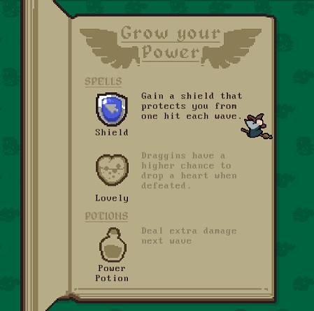
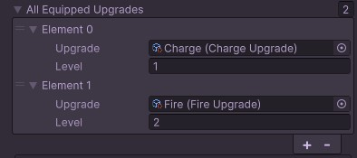
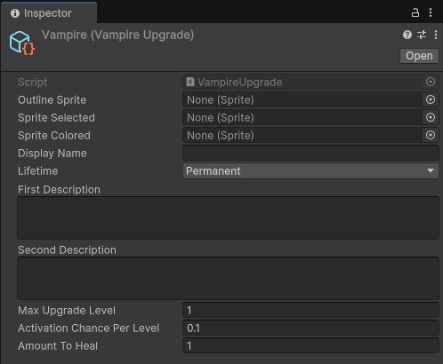
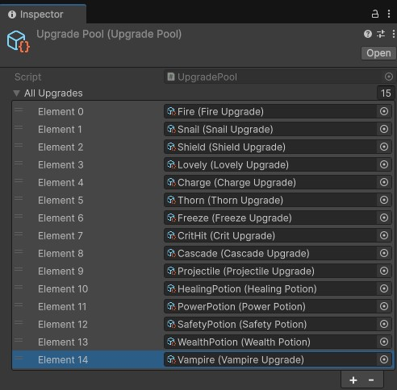

# Player Upgrade System

A core aspect of Draggin's gameplay is its player upgrades. When the player defeats a wave of enemies, they are brought to an upgrade screen where they are able to select either a permanent upgrade or a temporary boost.

Within the context of the game, permanent upgrades are referred to as "spells" and non-permanent upgrades are referred to as "potions".



When we designed the upgrade mechanic, we decided upon the following constraints:

1. The player can only equip a fixed number of unique spells per run.
2. The same spell may be gained multiple times, up to a maximum limit. Doing so increases the "level" of the upgrade rather than occupying a separate spell slot.
3. When the player has a spell in all spell slots, spells of new types should not be offered to the player on the upgrade screen.
4. Potions do not count towards the spell slot limit and may be offered to the player even if their slots are all full and maxed out.
5. Upgrade implementations must be able to respond to important gameplay events.

To satisfy this design, I created a global framework that maintains a list of currently equipped upgrades and sends gameplay events to each as they occur. Upgrade implementations in this list inherit from a common parent, which allows them to behave polymorphically. The main benefit of this system is that it has provided a quick and flexible interface for building new upgrades without requiring complete knowledge of the framework. 

This architecture pattern was loosely inspired by the structure of the modding API of The Binding of Isaac: Repentance, though it utilizes C# scripting rather than Lua.

## Structure

The Player Upgrade System is built upon two main classes: [PlayerUpgradeSystem](./PlayerUpgradeSystem.cs), which is the global container and controller for equipped upgrades, and [BaseUpgrade](./BaseUpgrade.cs), which provides the API each upgrade implementation needs to interface with the game world.

### PlayerUpgradeSystem

The `PlayerUpgradeSystem` is a component attached to a `PlayerManager` singleton object in the game's main scene. The `PlayerUpgradeSystem`'s primary responsibilities are to: 

- Track the player's currently equipped upgrades.
- Allow external systems to access information about equipped and available upgrades.
- Allow external systems to add and remove upgrades from the player's loadout.
- Act as source of truth for which upgrades are eligible to be equipped.
- Propagate gameplay events to each equipped upgrade.

#### Equipped Upgrade List

This system maintains a list of the player's equipped upgrades, alongside an integer value representing that upgrade's current level. Upon adding an upgrade, if it is already present in the list, the level is incremented instead of adding a new list item.

Assuming the player equipped the "Charge" upgrade once, and the "Fire" upgrade twice during their run, the upgrade list would appear like so: 



#### Public API

As the system is exposed by a global singleton `PlayerManager` object, other scripts within the game can access its public API. 

In addition to adding and removing upgrades and retrieving the player's current upgrade loadout, the class offers the ability to retrieve all upgrades in the game that are eligible to be equipped. 

As the player has limited spell slots, some logic is required to determine which upgrades are eligible to be equipped.

The following logical flow determines whether an upgrade will appear as eligible

```
if this upgrade is the reward of an uncompleted challenge: 
    return false // upgrade is locked

else if this upgrade is a potion:
    return true // potions are not constrained by spell slot status

else: // this upgrade is a spell
    if player has the max level of this spell:
        return false

    else if player has any open spell slots:
        return true

    else:
        if player has at least one level of this spell:
            return true
        else:
            return false
```

#### Event Propagation

The `PlayerUpgradeSystem` acts as a centralized point for transmitting game information to upgrade scripts. This allows the system to initialize itself once at the beginning of the game without needing to subscribe and unsubscribe each upgrade from global events when they are added or removed from the list. This also allows the system to pass extra information to the upgrade scripts that is not provided by the game events, namely the current level of the upgrade.

The `Start` method of `PlayerUpgradeSystem` shown below demonstrates this initialization. The system subscribes to a multitude of global events from various sources, and the listener methods receive the appropriate information and call the corresponding `BaseUpgrade` method on each equipped upgrade.

```c#
// The Start method of PlayerUpgradeSystem.cs at time of writing
private void Start()
{
    GameManager gm = GameManager.Instance;
    gm.onGameStateChanged.AddListener(OnGameStateChanged); // Has extra logic beyond propagation

    PlayerManager pm = PlayerManager.Instance;

    DragZone dragZone = pm.DragZone;
    dragZone.beginDrag.AddListener(PropagateBeginDrag);
    dragZone.continueDrag.AddListener(PropagateContinueDrag);
    dragZone.completeDrag.AddListener(PropagateCompleteDrag);
    dragZone.objectEnteredDragZone.AddListener(PropagateObjectEnteredDragZone);
    dragZone.objectExitedDragZone.AddListener(PropagateObjectExitedDragZone);

    PlayerHealthSystem health = pm.HealthSystem;
    health.damaged.AddListener(PropagatePlayerDamaged);
    health.healed.AddListener(PropagatePlayerHealed);
    health.preventedDamage.AddListener(PropagatePlayerPreventedDamage);
    
    BattleManager bm = BattleManager.Instance;
    bm.enemyDamaged.AddListener(PropagateEnemyDamaged);
    bm.enemyKilled.AddListener(PropagateEnemyKilled);
    bm.startedWave.AddListener(PropagateStartedWave);
    bm.finishedWave.AddListener(PropagateFinishedWave);
}

// ... 

// One of the propagation methods within PlayerUpgradeSystem.cs. Others are of a similar format
public void PropagateBeginDrag(DragContext context)
{
    allEquippedUpgrades.ForEach((UpgradeWithLevel row) => row.Upgrade.OnBeginDrag(context, upgradeLevel: row.Level));
}
```

### BaseUpgrade

The `BaseUpgrade` class is the parent class of all upgrade scripts. It inherits from `ScriptableObject` and consists of fields that define the upgrade's appearance, description, and other information. This includes an enum that defines whether the upgrade is a permanent spell or a temporary potion.

In addition to these fields, the base class defines an empty virtual event handler method for each of the global events propagated by the `PlayerUpgradeSystem`, with an extra int parameter encoding the current level of the equipped upgrade.

```c#
// One of the event handler definitions described above in BaseUpgrade.cs
public virtual void OnBeginDrag(DragContext context, int upgradeLevel) { }
```

To implement unique behavior for each upgrade, a child class of `BaseUpgrade` must be created, and any required event handler methods may be overridden. Some key examples of these implementations are included, namely [FireUpgrade](./FireUpgrade.cs), [ThornUpgrade](./ThornUpgrade.cs), [VampireUpgrade](./VampireUpgrade.cs), and [PowerPotion](./PowerPotion.cs). 

## Upgrade Creation Workflow

The workflow for creating a new upgrade is intended to be simple, without requiring deep understanding of the Player Upgrade System to implement new upgrades.

To demonstrate this process, we will walk through the process of creating the "Vampire" upgrade, which adds a chance to heal the player upon defeating an enemy.

### Create an Upgrade Script

First, create a basic script to house the implementation. It is important that the script inherits from `BaseUpgrade` and is given the `CreateAssetMenu` attribute.

```c#
using UnityEngine;

[CreateAssetMenu(fileName = "Vampire", menuName = "Upgrades/Vampire")]
public class VampireUpgrade : BaseUpgrade
{
}
```

### Override Event Listeners to Create Functionality

For the upgrade to work as intended, it will need to be notified whenever an enemy has been killed. Luckily, `BaseUpgrade` has the event handler `OnEnemyKilled` which we can override in the new upgrade script. Within this method, we will implement the functionality of the upgrade.

```c#
using UnityEngine;

[CreateAssetMenu(fileName = "Vampire", menuName = "Upgrades/Vampire")]
public class VampireUpgrade : BaseUpgrade
{
    public override void OnEnemyKilled(EnemyDamageContext ctx, int upgradeLevel) 
    {
        float leveledActivationChance = 0.1f * upgradeLevel;
        bool activated = Random.value <= leveledActivationChance;
        if (activated) 
        {
            PlayerManager.Instance.HealthSystem.Heal(1);
        }
    }
}
```

### Serialize Upgrade-specific Information

Because the script inherits from a ScriptableObject, we can add additional serialized fields to increase the configurability of the upgrade in the inspector. For the purposes of this upgrade, we will serialize the activation chance per level and the amount of health the player will gain.

```c#
using UnityEngine;

[CreateAssetMenu(fileName = "Vampire", menuName = "Upgrades/Vampire")]
public class VampireUpgrade : BaseUpgrade
{
    [Tooltip("Probability of the effect activating upon killing an enemy")]
    [Range(0,1)]
    public float activationChancePerLevel = 0.1f;
    
    [Tooltip("How much heath the player will gain when the effect activates")]
    public int amountToHeal = 1;

    public override void OnEnemyKilled(EnemyDamageContext ctx, int upgradeLevel) 
    {
        float leveledActivationChance = activationChancePerLevel * upgradeLevel;
        bool activated = Random.value <= leveledActivationChance;
        if (activated) 
        {
            PlayerManager.Instance.HealthSystem.Heal(amountToHeal);
        }
    }
}
```

### Create ScriptableObject Instance

Now that the upgrade script is complete, we need to create a corresponding asset. Because we added the `CreateAssetMenu` attribute, we can do so by selecting `Create > Upgrades > Vampire`. Upon doing so we will create this asset:



The fields in the inspector can then be filled in and updated as needed. Note that the "Lifetime" field is set to "Permanent". This will treat the Vampire upgrade as a spell that occupies a slot.

### Add Upgrade to Global List

For the upgrade to appear in the game, it will need to be added to the global list of upgrades held by the `PlayerUpgradeSystem`. This is an `UpgradePool` ScriptableObject kept within the project. Once the Vampire asset is added to this list, the upgrade will appear in game and the player will be able to equip and use it. 



## Areas for Improvement

### Automate New Upgrade Creation

As can be seen above, the workflow for creating a new upgrade has room for improvement. It requires creating a script, creating an asset of that script's type, and then adding that asset to another list within the project. This presents multiple potential points of confusion or error for the person creating a new upgrade.

Many of these steps can be easily automated via an editor window or wizard. This would dramatically reduce points of friction in the upgrade creation process.

### Runtime Efficiency

At this time, when any of the global events that `PlayerUpgradeSystem` is subscribed to occurs, it will call the event handler method of every equipped upgrade, regardless of whether a nontrivial overridden implementation exists or not. While this has not had any significant effects on performance at time of writing, it is a noteworthy point of inefficiency.

A possible solution for this would be to replace the virtual methods in `BaseUpgrade` with individual interfaces, each implementing a single event handler. `PlayerUpgradeSystem` could then filter its list based on which interfaces have been implemented. This would result in higher maintenance overhead however, and I have not yet explored via profiling whether this would prove to be more efficient than the current implementation. 

### ScriptableObject Assets Versus Runtime Instances

The list of equipped upgrades in `PlayerUpgradeSystem` contains references to the upgrade ScriptableObject assets themselves. In general, it is preferable to avoid altering ScriptableObject assets at runtime, as it can have unpredictable effects particularly in the editor between play mode sessions. 

As it became clear that many upgrade scripts we implemented needed mutable private fields to accomplish their functionality, these issues have become more prevalent. 

The system could be easily refactored to instantiate a copy of the ScriptableObject to occupy a place in the list, rather than referencing the asset itself. This solution is imperfect, but it will be simple to implement and resolve the main issue.
