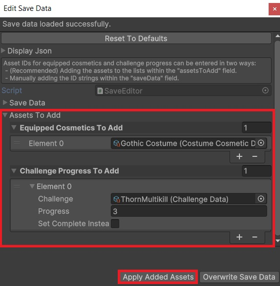

# Save Editor Wizard

This sample is a save editor tool I wrote for Draggin. As the game grew in complexity, and we introduced content that would be gated behind specific progression challenges, it became clear that we would need a simple way of adjusting the game's save files. This ability significantly sped up the rate at which we could prototype and debug new features.

## Structure

The Save Editor Wizard consists of an editor window extending Unity's `ScriptableWizard` class. This base class provides convenient functionality on top of the `Editor` class that was useful for this purpose. 

The editor is accessible to users via the upper toolbar of the Unity editor via the path `Draggin > Save Editor Wizard`.

When the window is created by the user, it loads the current save data for the game and caches it to be edited and, once finished, written back to disk.

The Wizard UI consists of a few main sections:

### Json Preview Window

A collapsible read-only window displaying the cached save data in its unencrypted json format. 

### Serialized Save Data Object

A property drawer exposing the cached save data object, allowing it to be updated directly by the user. This is useful for providing direct access to the fields that will be written to disk.

### Assets to Add Lists

The save file for Draggin encodes equipped cosmetics and in-progress challenges via unique string IDs. When the game loads, these are matched against global lists of `BaseCosmeticData` and `ChallengeData` scriptable objects to retrieve the full information. 

Adding these string IDs manually via the above serialized object can be fragile and inconvenient, since they need to match existing assets exactly. This section is intended to address that issue.

This section consists of two lists, which take in references to the appropriate respective cosmetic and challenge assets. This allows the user to search the project for the desired cosmetic or challenge instead of needing to input string IDs by hand.

The "Apply Added Assets" button at the bottom of the wizard takes each item in these lists and adds their string IDs and appropriate information to the corresponding lists in the cached save data object, then clears both of the helper lists.

### Confirm Button

Once the save data has been updated to the desires of the user, they can click the "Overwrite Save Data" button. This will flush the cached save data object to the game's save file path and close the window.

## Areas for Improvement

While this tool has streamlined our workflow significantly, it has limitations. In this section I will describe a few aspects of the Save Editor Wizard that could be iterated upon to produce an even more useful tool. 

### Ambiguous Cosmetic and Challenge Workflow

The greatest weakness of this save editor is the coexistence of the directly serialized save data and the Assets to Add lists. In an ideal system, the cosmetic and challenge ID lists of the save data object would be robustly editable without requiring the extra step of assembling and processing these additional lists.

One option would be to stop exposing the cached save data object, and instead create a GUI field for each of the data object's fields, mapping the string IDs to their associated asset. This solution would fix the ambiguity, but would be more fragile to changes in the structure of the save data object and would require more overhead when loading the save data from disk, as it would need to find the appropriate assets to map against each string ID in the list.
 
### Filepath rigidity

The game currently has a fixed relative path that it attempts to read save data from. The Save Editor Wizard follows this path when reading and writing save data. This has worked well for existing use cases, but further flexibility could be added by making save and load paths configurable.

If the path read from and written to could be selected by the user, this would open the possibility of maintaining several save "presets" that could be swapped in and out as needed depending on the desired state of the game.