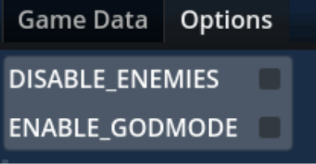
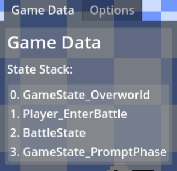
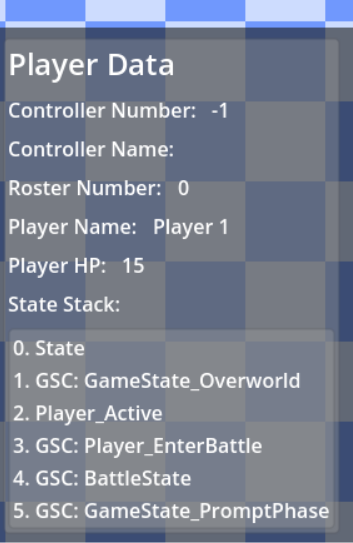
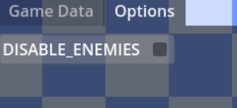

# Preface

This README begins with context on my contributions to the project, and transitions into the actual documentation included with the debug menu within the client's project.

## Context

The client requested that I implement a debug menu with four major functionalities:
1. It can be accessed and dismissed at any time during gameplay in a debug build.
2. It displays the current state hierarchy of the game world's state machine. 
3. It displays the current state hierarchy of each active player, adding and removing entries as players connect and disconnect.
4. It allows random enemy encounters to be enabled and disabled.

To accomplish these requirements, I created a debug overlay scene that is attached to a singleton manager script. The debug UI is enabled via a configurable input binding and navigated via the mouse as per request of the client.

When approaching the request to allow disabling enemy encounters, I wanted to provide a solution that would accommodate future needs. For that reason, I generalized this functionality into the debug flag system described below for flexibility. 

The client was impressed with this debug system and has informed me that it has streamlined his debugging and QA processes greatly.

### All content below this point is the documentation provided to my client

---

# Overview
The debug system consists of a singleton Debug Manager and a debug menu overlay. At time of writing, the system can be easily described as three major parts: Debug Manager, Game Info, and Options

# Debug Manager

| Relevant Scripts  | Relevant Scenes     |
|-------------------|---------------------|
| `DebugManager.gd` | `DebugManager.tscn` |
|                   | `DebugMenu.tscn`    |

The Debug Manager scene is the parent of the debug menu, and acts as the source-of-truth for debug information. The DebugManager class has control over the following:


## Enabling/Disabling Debug Globally

This is done in the scene view, using the export variable `_enable_debug`. If this variable is set to false, the DebugManager will destroy the debug menu UI upon initialization, and cause any DebugManager methods to gracefully fail. This setting cannot be changed at runtime, as it only controls initialization.


## Showing/Hiding Debug Menu at Runtime

The `DebugManager` class listens for the “debug_toggle” input action, and uses this to toggle the debug menu canvas on and off. By default, this action is bound to the F3 key, but more bindings can be added via the input settings for the project.


## Debug Flags

The Debug Manager singleton has an enum called Flags which is used to generate a list of boolean flags that act as the values for each defined debug setting. If the value is true, the debug setting is enabled, else, it is disabled. and can be accessed and updated in game code via the public methods described below. See Adding New Debug Flags for details on creating new debug settings.


## Public Methods

| Name                                              | Description                                                                                                                                                                                                                                                           |
|---------------------------------------------------|-----------------------------------------------------------------------------------------------------------------------------------------------------------------------------------------------------------------------------------------------------------------------|
| `debug_is_enabled()`                              | Basic check that determines if debug system is enabled. Will return false if debug is disabled in editor or if the game is running a release build. This method is used by other public methods of the class to prevent debug behavior from occurring in these cases. |
| `get_flag(flag: DebugManager.Flags)`              | If debug is enabled and the parameter is a valid debug flag, returns the value of that debug flag. In all other cases returns false.                                                                                                                                  |
| `set_flag(flag: DebugManager.Flags, value: bool)` | If debug is enabled and the parameter is a valid debug flag, sets the given flag to the provided bool value. You will likely not need to use this, as it is used by the DebugToggle buttons themselves                                                                |


## Signals

| Name                                                        | Description                                                                                           |
|-------------------------------------------------------------|-------------------------------------------------------------------------------------------------------|
| `debug_flag_changed(flag: DebugManager.Flags, value: bool)` | Emitted when a debug flag is updated in set_flag. Parameters are the affected flag and its new value. |


## Adding new Debug Flags
The debug menu automatically checks the `DebugManager.Flags` enum when generating the buttons in the Debug Menu. All you need to do to add another debug flag is define it as a new value in Flags. <br/><b>Note: These enum values are used as array indices, so they should not be given special int values</b>

Assume you want to create a new debug setting that prevents players from taking damage while active.

1. Add your new flag to the DebugManager.Flags list
```gdscript
enum Flags {
    DISABLE_ENEMIES,
    ENABLE_GODMODE # new flag
}
```
Upon adding the new enum value and running the game, you should notice the new flag appear in the Debug Options menu like so:



2. Once you have created the new flag, you can access it via the DebugManager’s `get_flag` method at the appropriate spot in your code. <b>Note that when doing this, it will always return false in a non-debug build.</b>!

```gdscript
func takeDamage(dmg: int):
    if (DebugManager.get_flag(DebugManager.Flags.ENABLE_GODMODE)):
        return
    super(dmg)
    emit_signal("healthRemaining", hp)
```


# Game Data
| Relevant Scripts               | Relevant Scenes                  |
|--------------------------------|----------------------------------|
| `DebugGameStackDisplay.gd`     | `DebugGameStackDisplay.tscn`     |
| `DebugPlayerDataController.gd` | `DebugPlayerDataController.tscn` |
| `DebugPlayerDataDisplay.gd`    | `DebugPlayerDataDisplay.tscn`    |


The Game Data page of the debug menu consists of scenes that track the game’s state and player state


## DebugGameStackDisplay

The `DebugGameStackDisplay` class/scene observes and displays the state stack of the game itself. At time of writing, it updates its data in _process, and displays a string that shows the current state stack of the game.




## DebugPlayerDataController
The `DebugPlayerDataController` class/scene spawns, destroys, and contains `DebugPlayerDataDisplay` instances. It listens for changes to the player roster, and when a player joins or leaves, the appropriate Display scene will be created or destroyed appropriately.


## DebugPlayerDataDisplay
`DebugPlayerDataDisplay` has similar functionality to `DebugGameStackDisplay`, with more player-specific extensions. Each instance of this scene is associated with a specific `PlayerInfo`, which is provided to it upon initialization by the `DebugPlayerDataController`.

The display then checks for changes to player information in `_process`, and prints them to the debug menu as strings. At time of writing, the following information is tracked:

* Controller Number
* Controller Name
* Player Roster Number
* Player Name
* Player HP
* Player State Stack
  * This is tracked and printed similarly to the DebugGameStackDisplay




# Options
| Relevant Scripts      | Relevant Scenes         |
|-----------------------|-------------------------|
| `DebugOptionsMenu.gd` | `DebugOptionsMenu.tscn` |
| `DebugToggle.gd`      | `DebugToggle.tscn`      |


The Options page of the debug menu displays and allows updates to the DebugManager’s debug flags. At time of writing only boolean flags are supported, though number/string/more complex behavior could be added in the future


## DebugOptionsMenu
The `DebugOptionsMenu` class/scene requests the list of valid debug flags, then creates a `DebugToggle` scene for each debug flag. This scene holds the container for these toggles.


## DebugToggle
The `DebugToggle` class/scene is created and initialized by the `DebugOptionsMenu`. At initialization, each instance is associated with a specific debug flag. At initialization, a few operations occur.
The label is updated to match the name of the flag

The toggle button’s toggled signal is connected to a method that updates the appropriate debug flag’s value
A listener is added to `DebugManager.debug_flag_changed` to ensure that the toggle’s appearance always matches the value held by the manager. 


